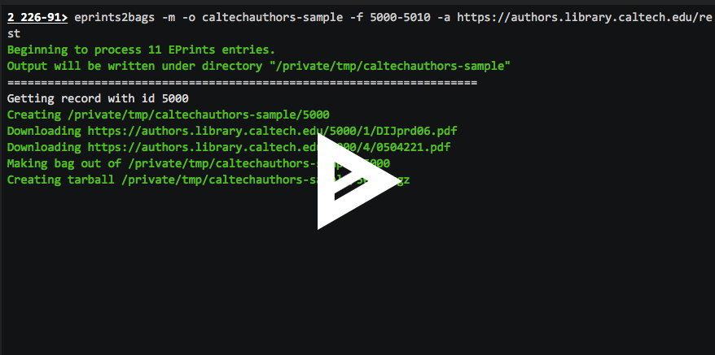

eprints2bags
=========

A program for downloading records from an EPrints server and creating [BagIt](https://en.wikipedia.org/wiki/BagIt) packages out of them.

*Authors*:      [Michael Hucka](http://github.com/mhucka), [Betsy Coles](https://github.com/betsycoles)<br>
*Repository*:   [https://github.com/caltechlibrary/eprints2bags](https://github.com/caltechlibrary/eprints2bags)<br>
*License*:      BSD/MIT derivative &ndash; see the [LICENSE](LICENSE) file for more information

[](https://choosealicense.com/licenses/bsd-3-clause)
[](http://shields.io)
[](http://shields.io)
[](https://data.caltech.edu/badge/records/1145)

🏁 Log of recent changes
-----------------------

_Version 1.4.0_: This release (a) fixes an important network handling bug that could cause incomplete records to be saved, (b) fixes bugs in handling network exceptions while downloading content from servers, (c) improves detection of file system limitations, (d) makes `-o` an optional argument, (e) fixes a missing Python package import, (f) renames `CONDUCT.md` to [`CODE_OF_CONDUCT.md`](CODE_OF_CONDUCT.md) so that GitHub can find it,  (g) adds [`CONTRIBUTING.md`](CONTRIBUTING.md), and (h) updates the documentation.  This release also fixes some other minor bugs and includes some internal code refactoring.

The file [CHANGES](CHANGES.md) contains a more complete change log that includes information about previous releases.


Table of Contents
-----------------

* [Introduction](#-introduction)
* [Installation instructions](#-installation-instructions)
* [Using eprints2bags](#︎-using-eprints2bags)
* [Getting help and support](#-getting-help-and-support)
* [Do you like it?](#-do-you-like-it)
* [Contributing — info for developers](#-contributing--info-for-developers)
* [History](#-history)
* [Acknowledgments](#︎-acknowledgments)
* [Copyright and license](#︎-copyright-and-license)


☀ Introduction
-----------------------------

Materials in EPrints must be extracted before they can be moved to a long-term preservation system or dark archive.  _Eprints2bags_ is a self-contained program that encapsulates the processes needed to download records and documents from EPrints, bundle up individual records in [BagIt](https://en.wikipedia.org/wiki/BagIt) packages, and create single-file archives (e.g., in [ZIP](https://en.wikipedia.org/wiki/Zip_(file_format)) format) of each bag.  The program is written in Python 3 and works over a network using an EPrints server's REST API.


✺ Installation instructions
---------------------------

The following is probably the simplest and most direct way to install this software on your computer, as well as update an existing copy if you have already installed `eprints2bags` and a new version has been released:
```sh
sudo python3 -m pip install git+https://github.com/caltechlibrary/eprints2bags.git --upgrade
```

Alternatively, you can instead clone this GitHub repository and then run `setup.py` manually.  First, create a directory somewhere on your computer where you want to store the files, and cd to it from a terminal shell.  Next, execute the following commands:
```sh
git clone https://github.com/caltechlibrary/eprints2bags.git
cd eprints2bags
sudo python3 -m pip install . --upgrade
```

On Linux and macOS systems, assuming that the installation proceeds normally, you should end up with a program called `eprints2bags` in a location normally searched by your terminal shell for commands.

▶︎ Using Eprints2bags
---------------------

`eprints2bags` contacts an EPrints REST server whose network API is accessible at the URL given by the command-line option `-a` (or `/a` on Windows).  A typical EPrints server URL has the form `https://somename.yourinstitution.edu/rest`.  The `-a` (or `/a`) option is required; the program cannot infer the server address on its own.

The EPrints records to be written will be limited to the list of numerical EPrints identifiers found in the file given by the option `-i` (or `/i` on Windows).  If no `-i` option is given, `eprints2bags` will download all the contents available at the given EPrints server.  The value of `-i` can also be one or more integers separated by commas (e.g., `-i 54602,54604`), or a range of numbers separated by a dash (e.g., `-i 1-100`, which is interpreted as the list of numbers 1, 2, ..., 100 inclusive), or some combination thereof.

By default, if a record requested or implied by the arguments to `-i` is missing from the EPrints server, this **is considered an error** and stops execution of the program.  If the option `-m` (or `/m` on Windows) is given, missing records will be ignored instead.  Option `-m` is particularly useful when giving a range of numbers with the `-i` option, as it is common for EPrints records to be updated or deleted and gaps to be left in the numbering.

`eprints2bags` writes its output in subdirectories under the directory given by the command-line option `-o` (or `/o` on Windows).  If the directory does not exist, this program will create it.  If no `-o` is given, the current directory where `eprints2bags` is running is used.  Whatever the destination is, `eprints2bags` will create subdirectories in the destination, with each subdirectory named according to the EPrints record number (e.g., `/path/to/output/430`, `/path/to/output/431`, `/path/to/output/432`, ...).  If the `-b` option (`/b` on Windows) is given, the subdirectory names are changed to have the form _BASENAME-NUMBER_ where _BASENAME_ is the text string provided with the `-b` option and the _NUMBER_ is the EPrints number for a given entry (meaning, `/path/to/output/BASENAME-430`, `/path/to/output/BASENAME-431`, `/path/to/output/BASENAME-432`, ...).


### Contents gathered and output produced

Each directory created by `eprints2bags` will contain an [EPrints XML](https://wiki.eprints.org/w/XML_Export_Format) file and additional document file(s) associated with the EPrints record in question.  The list of documents for each record is determined from the EPrints XML file, in the `<documents>` element.  Certain EPrints internal documents such as `indexcodes.txt` and `preview.png` are ignored.

After downloading a complete record from EPrints, this program creates [BagIt](https://en.wikipedia.org/wiki/BagIt) bags from the contents of the subdirectory created for the record.  This is done by default, after the documents are downloaded for each record, unless the `-B` option (`/B` on Windows) is given.  Note that creating bags is a destructive operation: it replaces the individual directories of each record with a restructured directory corresponding to the BagIt format.  The `-B` option prevents that, and can be useful when trying to debug problems or when bags are not needed.

The final step after creating each bag is to create a single-file archive of the bag contents.  By default, this is done in uncompressed [ZIP](https://en.wikipedia.org/wiki/Zip_(file_format)) format.  The option `-f` (or `/f` on Windows) can be used to change the archive format.  If given the value `none`, the bags are not put into an archive file and are instead left as-is.  Other possible values are: `compressed-zip`, `uncompressed-zip`, `compressed-tar`, and `uncompressed-tar`.  The default is `uncompressed-zip` (used if no `-f` option is given).  [ZIP](https://en.wikipedia.org/wiki/Zip_(file_format)) is the default because it is more widely recognized and supported than [tar](https://en.wikipedia.org/wiki/Tar_(computing)) format, and _uncompressed_ ZIP is used because file corruption is generally more damaging to a compressed archive than an uncompressed one.  Since the main use case for `eprints2bags` is to archive contents for long-term storage, avoiding compression seems safer even though it means the results take up more space.

The ZIP archive file will be written with a text comment describing the contents of the archive.  This comment can be viewed by ZIP utilities (e.g., using `zipinfo -z` on Unix/Linux and macOS).  The following is an example of a comment and the information it contains:

```
~ ~ ~ ~ ~ ~ ~ ~ ~ ~ ~ ~ ~ ~ ~ ~ ~ ~ ~ ~ ~ ~ ~ ~ ~ ~ ~ ~ ~ ~ ~ ~ ~ ~ ~
About this archive file:

This is an archive of a file directory organized in BagIt v1.0 format.
The bag contains the content from the EPrints record located at
http://resolver.caltech.edu/CaltechAUTHORS:SHIjfm98

The software used to create this archive file was:
eprints2bags version 1.3.1 <https://github.com/caltechlibrary/eprints2bags>

The following is the metadata contained in bag-info.txt:
Bag-Software-Agent: bagit.py v1.7.0 <https://github.com/LibraryOfCongress/bagit-python>
Bagging-Date: 2018-12-13
External-Description: Archive of EPrints record and document files
External-Identifier: http://resolver.caltech.edu/CaltechAUTHORS:SHIjfm98
Internal-Sender-Identifier: https://authors.library.caltech.edu/id/eprint/355
Payload-Oxum: 4646541.2
~ ~ ~ ~ ~ ~ ~ ~ ~ ~ ~ ~ ~ ~ ~ ~ ~ ~ ~ ~ ~ ~ ~ ~ ~ ~ ~ ~ ~ ~ ~ ~ ~ ~ ~
```

Archive comments are a feature of the [ZIP](https://en.wikipedia.org/wiki/Zip_(file_format)) file format and not available with [tar](https://en.wikipedia.org/wiki/Tar_(computing)).


### Login credentials

Downloading documents usually requires supplying a user login and password to the EPrints server.  By default, this program uses the operating system's keyring/keychain functionality to get a user name and password.  If the information does not exist from a previous run of `eprints2bags`, it will query the user interactively for the user name and password, and unless the `-K` argument (`/K` on Windows) is given, store them in the user's keyring/keychain so that it does not have to ask again in the future.  It is also possible to supply the information directly on the command line using the `-u` and `-p` options (or `/u` and `/p` on Windows), but this is discouraged because it is insecure on multiuser computer systems.

To reset the user name and password (e.g., if a mistake was made the last time and the wrong credentials were stored in the keyring/keychain system), add the `-R` (or `/R` on Windows) command-line argument to a command.  When `eprints2bags` is run with this option, it will query for the user name and password again even if an entry already exists in the keyring or keychain.


### Examples

Running `eprints2bags` then consists of invoking the program like any other program on your system.  The following is a simple example showing how to get a single record (#85447) from Caltech's [CODA](https://libguides.caltech.edu/CODA) EPrints server (with user name and password blanked out here for security reasons):

```
# eprints2bags -o /tmp/eprints -i 85447 -a https://authors.library.caltech.edu/rest -u XXXXX -p XXXXX

Beginning to process 1 EPrints entry.
Output will be written under directory "/tmp/eprints"
======================================================================
Getting record with id 85447
Creating /tmp/eprints/85447
Downloading https://authors.library.caltech.edu/85447/1/1-s2.0-S0164121218300517-main.pdf
Making bag out of /tmp/eprints/85447
Creating tarball /tmp/eprints/85447.tgz
======================================================================
Done. Wrote 1 EPrints record to /tmp/eprints/.
```

The following is a screen cast to give a sense for what it's like to run `eprints2bags`. Click on the following image:

<p align="center">
  <a href="https://asciinema.org/a/v13itB47vfE8CYF4LMFTgqlZy"></a>
</p>


### Summary of command-line options

The following table summarizes all the command line options available. (Note: on Windows computers, `/` must be used as the prefix character instead of `-`):

| Short   | Long&nbsp;form&nbsp;opt | Meaning | Default |  |
|---------|-------------------|----------------------|---------|---|
| `-a`_A_ | `--api-url`_A_    | Use _A_ as the server's REST API URL | | ⚑ |
| `-b`_B_ | `--base-name`_B_  | Name the records with the template _B_-n | Use only the record id number, n  | |
| `-f`_F_ | `--final-fmt`_F_  | Create single-file archive in format _F_ | Uncompressed ZIP archive | |
| `-i`_L_ | `--id-list`_L_    | List of records to get (can be a file name) | Fetch all records from the server | |
| `-m`    | `--missing-ok`    | Don't count missing records as an error | Stop if missing record encountered | |
| `-o`_O_ | `--output-dir`_O_ | Write outputs in the directory _O_ | Write in the current directory |  |
| `-u`_U_ | `--user`_U_       | User name for EPrints server login | |
| `-p`_P_ | `--password`_U_   | Password for EPrints proxy login | |
| `-y`_Y_ | `--delay`_Y_      | Pause _Y_ ms between getting records | 100 milliseconds | |
| `-q`    | `--quiet`         | Don't print info messages while working | Be chatty while working | |
| `-B`    | `--no-bags`       | Don't create bags or archives | Do create bags & archives | |
| `-C`    | `--no-color`      | Don't color-code the output | Use colors in the terminal output | |
| `-K`    | `--no-keyring`    | Don't use a keyring/keychain | Store login info in keyring | |
| `-R`    | `--reset`         | Reset user login & password used | Reuse previously-used credentials |
| `-V`    | `--version`       | Print program version info and exit | Do other actions instead | |
| `-Z`    | `--debug`         | Debugging mode | Normal mode | |

 ⚑ &nbsp; Required argument.


### Additional notes and considerations

Beware that some file systems have limitations on the number of subdirectories that can be created, which directly impacts how many record subdirectories can be created by this program.  `eprints2bags` attempts to guess the type of file system where the output is being written and warn the user if the number of records exceeds known maximums (e.g., 31,998 subdirectories for the [ext2](https://en.wikipedia.org/wiki/Ext2) and [ext3](https://en.wikipedia.org/wiki/Ext3) file systems in Linux), but its internal table does not include all possible file systems and it may not be able to warn users in all cases.  If you encounter file system limitations on the number of subdirectories that can be created, a simple solution is to manually create an intermediate level of subdirectories under the destination given to `-o`, then run `eprints2bags` multiple times, each time indicating a different subrange of records to the `-i` option and a different subdirectory to `-o`, such that the number of records written to each destination is below the file system's limit on total number of directories.

It is also noteworthy that hitting a server for tens of thousands of records and documents in rapid succession is likely to draw suspicion from server administrators.  By default, this program inserts a small delay between record fetches (adjustable using the `-d` command-line option), which may be too short in some cases.  Setting the value to 0 is also possible, but might get you blocked or banned from an institution's servers.


⁇ Getting help and support
--------------------------

If you find an issue, please submit it in [the GitHub issue tracker](https://github.com/caltechlibrary/eprints2bags/issues) for this repository.


★ Do you like it?
------------------

If you like this software, don't forget to give this repo a star on GitHub to show your support!


♬ Contributing &mdash; info for developers
------------------------------------------

We would be happy to receive your help and participation with enhancing `eprints2bags`!  Please visit the [guidelines for contributing](CONTRIBUTING.md) for some tips on getting started.


❡ History
--------

In 2018, [Betsy Coles](https://github.com/betsycoles) wrote a [set of Perl scripts](https://github.com/caltechlibrary/eprints2dpn) and described a workflow for bagging contents from Caltech's EPrints-based [Caltech Collection of Open Digital Archives (CODA)](https://libguides.caltech.edu/CODA) server.  The original code is still available in this repository in the [historical](historical) subdirectory.  In late 2018, Mike Hucka sought to expand the functionality of the original tools and generalize them in anticipation of having to stop using DPN because on 2018-12-04, DPN announced they were shutting down. Thus was born _Eprints2bags_.


☺︎ Acknowledgments
-----------------------

The [vector artwork](https://thenounproject.com/search/?q=bag&i=1002779) of a bag used as a logo for this repository was created by [StoneHub](https://thenounproject.com/stonehub/) from the Noun Project.  It is licensed under the Creative Commons [CC-BY 3.0](https://creativecommons.org/licenses/by/3.0/) license.

`eprints2bags` makes use of numerous open-source packages, without which it would have been effectively impossible to develop `eprints2bags` with the resources we had.  We want to acknowledge this debt.  In alphabetical order, the packages are:

* [bagit](https://github.com/LibraryOfCongress/bagit-python) &ndash; Python library for working with [BagIt](https://tools.ietf.org/html/draft-kunze-bagit-17) style packages
* [colorama](https://github.com/tartley/colorama) &ndash; makes ANSI escape character sequences work under MS Windows terminals
* [humanize](https://github.com/jmoiron/humanize) &ndash; helps write large numbers in a more human-readable form
* [ipdb](https://github.com/gotcha/ipdb) &ndash; the IPython debugger
* [keyring](https://github.com/jaraco/keyring) &ndash; access the system keyring service from Python
* [lxml](https://lxml.de) &ndash; an XML parsing library for Python
* [plac](http://micheles.github.io/plac/) &ndash; a command line argument parser
* [psutil](https://github.com/giampaolo/psutil) &ndash; process and system utilities
* [requests](http://docs.python-requests.org) &ndash; an HTTP library for Python
* [setuptools](https://github.com/pypa/setuptools) &ndash; library for `setup.py`
* [termcolor](https://pypi.org/project/termcolor/) &ndash; ANSI color formatting for output in terminal
* [urllib3](https://urllib3.readthedocs.io/en/latest/) &ndash; HTTP client library for Python

☮︎ Copyright and license
---------------------

Copyright (C) 2018, Caltech.  This software is freely distributed under a BSD/MIT type license.  Please see the [LICENSE](LICENSE) file for more information.
    
<div align="center">
  <a href="https://www.caltech.edu">
    
  </a>
</div>
